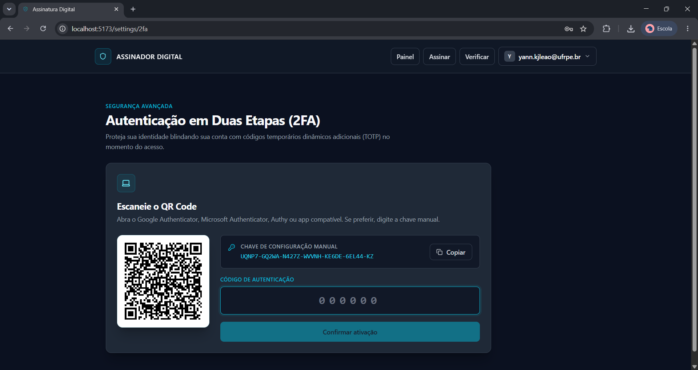
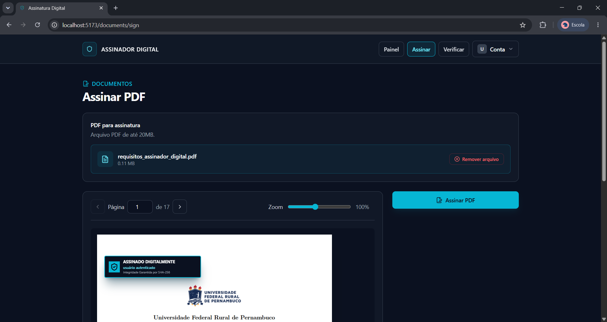

# Plataforma de Assinatura Digital de PDFs

[](https://openjdk.org/)
[](https://spring.io/projects/spring-boot)
[](https://www.typescriptlang.org/)
[](https://react.dev/)
[](https://www.postgresql.org/)

Projeto fullstack de segurança da informação focado em autenticação multifator de alta segurança, criptografia 
assimétrica para assinatura digital de documentos PDF com validade jurídica simulada, verificação pública de 
autenticidade e trilha de auditoria imutável.

> [!NOTE]
> [Quadro Kanban do Projeto](https://github.com/users/YannLeao/projects/6)
>
> [Documentação das decisões de arquitetura e criptografia](/docs).

## Demonstração da Interface

### Autenticação de Dois Fatores (TOTP)
*Fluxo de 2FA baseado na RFC 6238, QR Code dinâmico para integração com Autenticador.*


### Assinatura Digital de Documentos
*Área restrita onde o usuário realiza o upload do PDF, visualiza o documento e posiciona dinamicamente o selo gráfico de
assinatura na página e coordenadas desejadas.*


## Segurança & Funcionalidades

O projeto cumpre rigorosamente as melhores práticas recomendadas pelo **OWASP** e normas internacionais de criptografia:

### 1. Autenticação Avançada & MFA
* **Armazenamento de Senhas:** Hash utilizando **Argon2id** com os parâmetros recomendados pelo OWASP (Memory: 64MB, Iterations: 3, Parallelism: 4). Zero uso de algoritmos legados (bcrypt/md5).
* **Passkeys (WebAuthn/FIDO2):** Fluxo criptográfico completo diretamente atrelado à origem do site, mitigando riscos de phishing e com validação anti-clonagem baseada em contador de uso (`counter`).
* **TOTP (2FA):** Algoritmo baseado em tempo (RFC 6238) com janela de tolerância de $\pm1$ para mitigar desvios de relógio. Códigos de recuperação únicos gerados e armazenados via hash.
* **Mecanismos Antifraça-Bruta:** Rate limiting granular por IP e por conta no endpoint de login, além de bloqueio temporário (15 min) após 5 tentativas consecutivas falhas.

### 2. Gestão de Tokens Estritos (JWT & Refresh)
* **Criptografia Assimétrica:** Access Tokens (JWT) assinados via par de chaves assimétricas **RS256** (validade de 15 minutos).
* **Refresh Token Rotation (RTR):** Refresh token opaco (UUIDv7) de uso único e armazenado no banco com hash. Caso o mesmo token seja reutilizado, o sistema detecta o comprometimento e invalida toda a família de sessões do usuário.
* **Cookies Seguros:** Transporte via Cookies `HttpOnly`, `Secure` e `SameSite=Strict` para neutralizar ataques XSS e mitigar CSRF combinando proteção via *Double Submit Cookie*.
* **Denylist em Tempo Real:** Invalidação imediata do identificador único do token (`jti`) no logout.

### 3. Processamento de Criptografia e PDFs (ISO 32000)
* **Chaves por Usuário:** Geração automática de chaves RSA-2048/ECDSA P-256 no cadastro do usuário, protegidas com a chave mestra do servidor.
* **Assinatura Embutida:** A assinatura criptográfica é injetada na estrutura nativa do PDF (ISO 32000) e atrelada ao hash SHA-256 do arquivo original.
* **Verificação Pública Sem Estado:** Tela pública que analisa a estrutura do binário (não apenas o visual), compara hashes e valida a integridade na memória. Os arquivos **nunca** são salvos no disco do servidor, garantindo total conformidade com a **LGPD**.
* **Sanitização de Vetores:** Sandbox para execução do parsing do PDF, barramento de arquivos com `/JS` ou `/JavaScript` embutidos e validação estrita de *Magic Numbers* (`%PDF-`).

### 4. Auditoria Imutável
* Logs estruturados no formato *append-only* (imutáveis) registrando eventos críticos (login, assinaturas, falhas) contendo `userId`, `timestamp UTC`, `IP`, `User-Agent`, `ação` e `resultado`.

## Estrutura do Monorepo

```text
.
├── .github/
│   └── dependabot.yml # Atualizações semanais de segurança (Max 5 PRs)
├── backend/          # API REST Spring Boot 3 & Java 21 (Maven)
├── frontend/         # Aplicação SPA React + Vite + TypeScript & Tailwind CSS
└── docs/             # Arquitetura de Software, Modelagem e Segurança (CSP, CORS)

```

## Como Executar Localmente

### Pré-requisitos

* **Java 21** (JDK)
* **Node.js** (versão LTS recomendada) com npm
* **PostgreSQL** ativo
* **Git**

### 1. Configurando Variáveis de Ambiente

Copie o arquivo `.env.example` para `.env` na raiz de cada respectivo módulo para expor as credenciais do banco e as 
chaves JWT sem dados *hardcoded* no código fonte.

**Windows (PowerShell):**

```powershell
Copy-Item backend\.env.example backend\.env
Copy-Item frontend\.env.example frontend\.env

```

**Linux / macOS:**

```bash
cp backend/.env.example backend/.env && cp frontend/.env.example frontend/.env

```

### 2. Inicializando o Banco de Dados

Crie o banco de dados inicial no PostgreSQL. As tabelas serão criadas de forma automatizada pelo **Flyway** no startup do backend.

```sql
CREATE DATABASE digital_signature_db;

```

### 3. Rodando o Backend (API REST)

```bash
cd backend
./mvnw spring-boot:run

```

* **URL Base:** `http://localhost:8080/api/v1`
* **Health Check:** `GET http://localhost:8080/api/v1/health`

### 4. Rodando o Frontend (Web)

```bash
cd frontend
npm install
npm run dev

```

* **URL Local:** `http://localhost:5173`

## Gestão de Vulnerabilidades Automatizada

O projeto utiliza o **GitHub Dependabot** configurado com checagens semanais limitadas a no máximo 5 Pull Requests 
simultâneos para manter o ecossistema e bibliotecas de parsing livres de vulnerabilidades conhecidas (CVEs). Políticas 
detalhadas de auditoria e comandos adicionais encontram-se em 
[segurança de dependências](docs/security/dependency-audit.md).